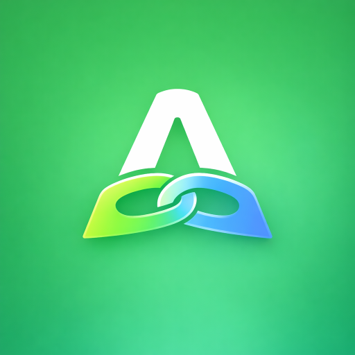

<p align="center">
  
  <br><br>
  <a href="https://buymeacoffee.com/mossyhub">
    
  </a>
</p>

# OpenAutoLink

> Android Auto for Android Automotive OS head units that do not include it.<br>
> Wireless or USB. No SBC, dongle, or additional hardware.

**Android only. OpenAutoLink does not currently support Apple CarPlay.**

OpenAutoLink runs the Android Auto protocol directly on the vehicle's Android Automotive OS (AAOS) head unit. It restores the phone-based Android Auto experience while integrating vehicle data, the instrument cluster, steering-wheel controls, microphone, calls, and ignition reconnects.

**Real-world GM EV use:**

- **2024 Chevrolet Blazer EV** — maintainer-validated daily driver
- **2025–2026 Chevrolet Equinox EV** — community-tested, including a successful independent owner report and earlier issue reports
- **2027 Chevrolet Bolt** — successful independent owner demonstration

GM's recent AAOS EVs share much of the same infotainment platform. A problem reported on one model or model year is recorded as an app/phone/setup observation—not proof that the vehicle is incompatible. OpenAutoLink and Android Auto are both changing quickly, so older reports may no longer reproduce on current builds.

[Latest release](https://github.com/mossyhub/openautolink/releases/latest) · [GM installation](docs/install-gm.md) · [Compatibility](docs/compatibility.md) · [Troubleshooting](docs/troubleshooting.md) · [XDA discussion](https://xdaforums.com/t/open-source-openautolink-wireless-android-auto-bridge-for-aaos-gm-evs.4785192/)

> [!IMPORTANT]
> GM production head units do not permit ADB installation or APK sideloading. The easiest route is the maintainer's Google Play test group: about 45 of 100 places are currently filled. If building and Play Console setup are blocking you, privately send the Google-account email used by your vehicle to the maintainer through the [XDA thread](https://xdaforums.com/t/open-source-openautolink-wireless-android-auto-bridge-for-aaos-gm-evs.4785192/) or [Reddit](https://www.reddit.com/user/IPickedThisUserID/). Do not post your email publicly. Self-publishing remains available for people who want their own app identity and release track.<br><br>
> Official builds are published on [GitHub Releases](https://github.com/mossyhub/openautolink/releases/latest). The companion APK installs on an Android phone. The car APK is for emulators and AAOS systems that permit sideloading; it cannot be sideloaded onto a locked GM production vehicle.

**Polestar and other AAOS owners wanted:** If your vehicle runs Android Automotive OS but does not include Android Auto, contact the maintainer through XDA or Reddit. OpenAutoLink needs real-vehicle testers beyond GM; installation, networking, audio, vehicle APIs, and display behavior must be proven on each platform.

[](https://github.com/mossyhub/openautolink/actions/workflows/ci.yml)
[](https://github.com/mossyhub/openautolink/releases/latest)

<p align="center">
  
  <br>
  <em>Android Auto streaming wirelessly on a 2024 Chevrolet Blazer EV</em>
</p>

<p align="center">
  
  <br>
  <em>Google Maps displaying battery data forwarded from the vehicle through OpenAutoLink</em>
</p>

## What it delivers

- **No additional hardware** — the AA protocol runs on the AAOS head unit
- **Wireless (WPP)** — factory-style Bluetooth bootstrap and Wi-Fi projection on Android Auto 17.4+; advertising, discovery, and transport stay on one explicitly selected head-unit interface with no cross-interface fallback
- **USB** — direct Android Open Accessory (AOA v2) transport
- **EV data in Google Maps** — battery percentage, range, fuel type, charge-port data, and a tunable energy model
- **Instrument cluster** — turn-by-turn navigation and media metadata on supported vehicles
- **Calls and microphone** — projected call controls with the vehicle's native Bluetooth hands-free audio path
- **Steering-wheel controls** — media, voice, call, and directional actions
- **Automatic reconnect** — projection resumes across ignition and head-unit sleep/wake cycles
- **Multi-phone support** — behavior depends on Android Auto version and transport
- **Wide-display adaptation** — configurable DPI, safe areas, margins, and scaling
- **Modern video support** — H.264, H.265, and VP9; manual tiers include 1440p (2560×1440) and 4K (3840×2160), plus portrait equivalents
- **Verified H.265 startup** — H.265 startup is verified clean over USB and wireless with GAL 6's 120-frame GOP
- **Per-codec seed filtering** — Settings → Video exposes startup-placeholder cutoffs; defaults are H.264 10,000 bytes, H.265 4,096 bytes, and VP9 disabled (0), with changes applied by Save & Reconnect
- **Built-in diagnostics** — transport status, network tools, VHAL browser, and optional log export

OpenAutoLink forwards the vehicle's real battery and range data into Android Auto. Google Maps uses the standard vehicle energy model for battery-aware navigation and destination estimates. See [EV range estimates](docs/ev-range.md).

## How it works

OpenAutoLink embeds [aasdk](https://github.com/opencardev/aasdk) v1.6 through C++/JNI. The native layer handles the Android Auto protocol, TLS, framing, and channels; Kotlin owns transport, video, audio, sensors, input, and UI.

### Wireless — Android Auto 17.4+

```text
Android phone                         AAOS head unit
┌────────────────────┐               ┌────────────────────────┐
│ Android Auto       │◄── BT WPP ──►│ OpenAutoLink           │
│ OAL Companion      │◄── Wi-Fi/TCP►│ aasdk C++ via JNI      │
└────────────────────┘               └────────────────────────┘
```

The head unit advertises the Android Auto Wireless service over Bluetooth and supplies the car access point's details. On this GM topology, Android Auto connects to a loopback proxy held by the companion, which relays the session across the vehicle network. **The companion remains required.**

Current Android Auto releases must use **Settings → Transport → Wireless (WPP)**. See the [WPP setup and 17.4 migration guide](docs/wireless-wpp.md).

### USB

```text
Android phone ───── AOA v2 / bulk USB ─────► OpenAutoLink on AAOS
```

USB does not use the companion. GM's AAOS build asks for USB permission on every connection even when **Always allow** is selected.

### Legacy Wi-Fi modes

**Car Hotspot** and **Phone Hotspot** remain available for Android Auto 17.3 and older. Android Auto 17.4 disabled the startup entry point used by those modes, so they are not current wireless fallbacks. The historical SBC bridge remains on the [`bridge-mode`](https://github.com/mossyhub/openautolink/tree/bridge-mode) branch.

## Compatibility

Compatibility is evidence-based, but individual bug reports are not treated as model-specific verdicts. GM's recent AAOS EVs share substantial platform architecture, while app version, Android Auto version, phone behavior, setup, and exact vehicle software can all affect a result.

| Vehicle | AAOS | Evidence | Report context |
|---|---:|---|---|
| 2024 Chevrolet Blazer EV | 12L | **Maintainer validated** | Daily use across many changing development builds; imperfect sessions have also driven ongoing fixes |
| 2025–2026 Chevrolet Equinox EV | 14 reported | **Community tested** | A [successful owner report](https://xdaforums.com/t/open-source-openautolink-wireless-android-auto-bridge-for-aaos-gm-evs.4785192/post-90708465), plus earlier [startup](https://xdaforums.com/t/open-source-openautolink-wireless-android-auto-bridge-for-aaos-gm-evs.4785192/post-90620330) and [USB](https://xdaforums.com/t/open-source-openautolink-wireless-android-auto-bridge-for-aaos-gm-evs.4785192/post-90686188) issue reports; those issues are not established as Equinox-specific and may be dated |
| 2027 Chevrolet Bolt | — | **Owner demonstrated working** | [Independent video](https://www.youtube.com/watch?v=xEYOxJroplQ) and [first-hand owner report](https://www.chevybolt.org/threads/openautolink-the-cheapest-way-to-get-andriod-auto-on-the-27-bolt.63027/), including occasional reconnect/slowness on the tested build |
| Other GM AAOS EVs | Varies | **Testing encouraged** | Shared GM platform makes broad compatibility plausible, but each successful report adds useful evidence |
| Non-GM AAOS vehicles | Varies | **Experimental** | Installation, networking, permissions, and display zoning can differ substantially |

Read the [full compatibility and evidence notes](docs/compatibility.md) before assuming a vehicle will work.

## What you need

| Item | Requirement |
|---|---|
| Vehicle | Compatible AAOS head unit without native Android Auto |
| Phone | Android phone running Android Auto and the OpenAutoLink Companion |
| Vehicle network | Car Wi-Fi access point for current wireless WPP, or a USB data connection |
| Locked-vehicle installation | A place in the maintainer's Play test group, or your own Play Console account, signing key, and test release |

No additional projection hardware is required. Locked vehicles still require Google Play delivery, either through the maintainer's test group or your own Play Console release.

## Installation

### Android phone

1. Open [the latest GitHub release](https://github.com/mossyhub/openautolink/releases/latest).
2. Download `openautolink-companion-vX.Y.Z.apk`.
3. Install it on the phone and allow the requested permissions.

Release APKs use the project's signing key. A locally built debug APK uses a different signature and cannot update over a release APK without uninstalling it first.

### Locked GM vehicle

**Recommended:** ask to join the maintainer's Google Play test group. It supports up to 100 people and currently has roughly 55 open places. Privately send the Google-account email used by the vehicle through the [XDA thread](https://xdaforums.com/t/open-source-openautolink-wireless-android-auto-bridge-for-aaos-gm-evs.4785192/) or [Reddit](https://www.reddit.com/user/IPickedThisUserID/). Do not put your email in a public comment.

**Independent route:** the [one-command personal AAB builder](docs/build-aab.md) asks for your package identity once, then handles source updates, signing, native dependencies, versioning, and verified AAB output in Docker. Run the same command for every later update. Preserve its state directory: future Play updates must use the same application ID and key.

Follow [Installing OpenAutoLink on a locked GM vehicle](docs/install-gm.md) for both routes. Do not download the car APK expecting to sideload it onto a production GM head unit.

### Other AAOS systems

The release car APK may be used only where the system permits APK installation. Installation alone does not prove the required network, Bluetooth, vehicle, audio, or display integration exists.

## Current wireless setup

For Android Auto 17.4 or newer:

1. Install matching current car and companion releases.
2. Enable the car's Wi-Fi access point.
3. In OpenAutoLink on the car, select **Settings → Transport → Wireless (WPP)**.
4. Enter the access point's SSID, password, and BSSID, then select the WPP network interface that serves that access point.
5. Pair the phone to the car over Bluetooth again after updating.
6. Keep the Bluetooth **Phone calls** profile enabled; **Media audio** may be disabled.
7. Remove any old **Car WiFi** entry from the companion so it does not compete with Android Auto for the same radio.
8. Select the car under the companion's **Auto-Start → Select Devices** list.
9. Save and reconnect.

Those are the short instructions. Read [Wireless WPP setup](docs/wireless-wpp.md) for the required BSSID, saved-network trade-offs, and multi-phone behavior.

## Demonstrations

### Current project walkthrough

The walkthrough demonstrates the interface and projection features. Its original Wi-Fi setup predates the Android Auto 17.4 WPP change; use the current WPP guide above for wireless setup.

[](https://youtu.be/2KcsTZalXcc)

### Independent 2027 Bolt demonstration

[](https://www.youtube.com/watch?v=xEYOxJroplQ)

## Current limitations

- **Apple CarPlay is not supported.** A dormant research branch exists, but it has never produced a complete CarPlay session or rendered frame.
- Android Auto 17.4+ requires **Wireless (WPP)**, a fresh Bluetooth pairing after migration, and correct access-point details.
- The companion is required for wireless projection on the validated GM topology.
- Startup, reconnect, speed, audio, and USB issues have appeared during development on multiple setups. Treat old reports as build-specific until reproduced on a current release—not as proof against a particular GM model.
- GM asks for USB permission after every connection; the platform does not preserve the grant.
- The car app cannot be sideloaded onto locked GM production head units.
- Non-GM AAOS compatibility is unknown until tested on the exact platform.

For release-specific defects, see [open issues](https://github.com/mossyhub/openautolink/issues) and [Troubleshooting](docs/troubleshooting.md).

## Documentation

| Guide | Purpose |
|---|---|
| [One-command AAB builder](docs/build-aab.md) | Docker-based first build, signing identity, updates, output, and backup |
| [GM installation](docs/install-gm.md) | Play Console, application ID, signing, AAB, and update path |
| [Wireless WPP](docs/wireless-wpp.md) | Android Auto 17.4+ setup, migration, and network behavior |
| [Compatibility](docs/compatibility.md) | Vehicle-by-vehicle evidence and support language |
| [Troubleshooting](docs/troubleshooting.md) | Connection, Wi-Fi, USB, audio, and logging checks |
| [EV range estimates](docs/ev-range.md) | Energy-model profiles, driving-rate modes, and tuning |
| [Phone calls](docs/phone-calls.md) | Keep projected controls while retaining native HFP audio |
| [Architecture](docs/architecture.md) | Component structure and data flow |
| [Embedded knowledge](docs/embedded-knowledge.md) | Hard-won protocol and hardware constraints |
| [Legacy SBC/emulator testing](docs/testing.md) | Historical bridge-mode emulator and diagnostic workflow |
| [Privacy policy](docs/privacy-policy.md) | Data access and handling |

## Does it support CarPlay?

No. OpenAutoLink currently implements Android Auto only.

A CarPlay research prototype proved access to a CPC200's MFi authentication chip and built preliminary discovery and relay components. It stopped before the post-authentication CarPlay receiver, encrypted media streams, video, audio, or input path existed. It is not a user-facing feature and is not under active development.

## Contributing and support

- Use [GitHub issues](https://github.com/mossyhub/openautolink/issues) for reproducible defects.
- Use the [XDA thread](https://xdaforums.com/t/open-source-openautolink-wireless-android-auto-bridge-for-aaos-gm-evs.4785192/) for setup discussion and vehicle reports.
- If building is the blocker, privately ask the maintainer about a place in the Google Play test group; do not publish your Google-account email.
- **Polestar and other non-GM AAOS owners:** please reach out if your vehicle lacks Android Auto. New platforms need installation and end-to-end projection testing.
- Include the exact vehicle, model year, AAOS version, Android Auto version, transport, and both car/companion logs where available.

## Acknowledgments

- [opencardev/aasdk](https://github.com/opencardev/aasdk) — core Android Auto protocol library; the OpenAutoLink fork adds navigation and EV energy-model extensions
- [metheos/carlink_native](https://github.com/metheos/carlink_native), [lvalen91/Carlink](https://github.com/lvalen91/Carlink), and the [XDA Carlink thread](https://xdaforums.com/t/carlink.4774308/) — original proof-of-concept inspiration and continued technical collaboration
- [opencardev/openauto](https://github.com/opencardev/openauto) — head-unit architecture reference
- [nisargjhaveri/WirelessAndroidAutoDongle](https://github.com/nisargjhaveri/WirelessAndroidAutoDongle) — Bluetooth and Wi-Fi bootstrap reference
- [andreknieriem/open-headunit](https://github.com/andreknieriem/open-headunit) — receiver and protocol reference

## License

OpenAutoLink is licensed under the [GNU General Public License v3.0](LICENSE).
